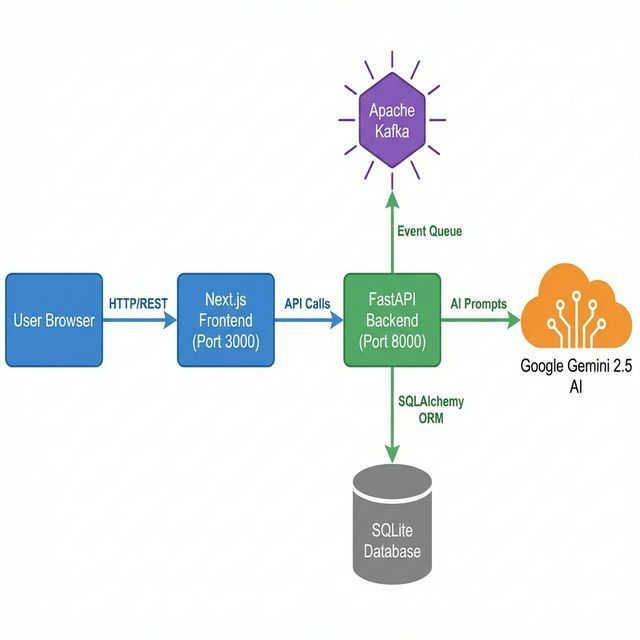
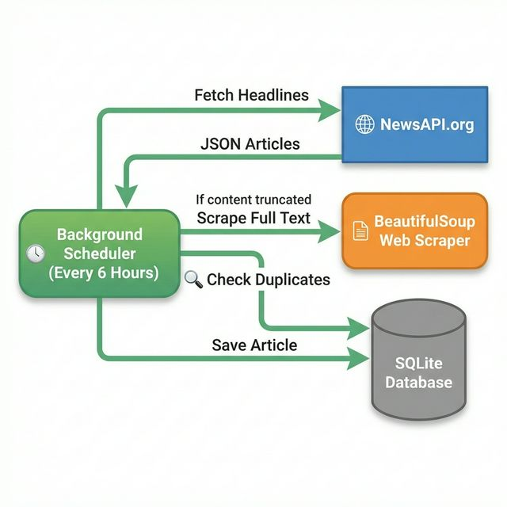
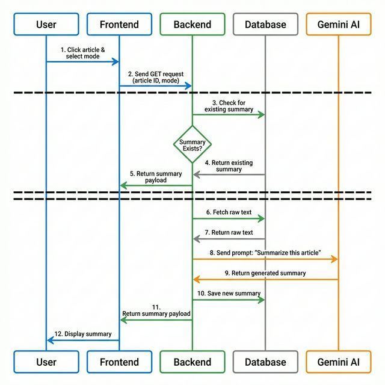
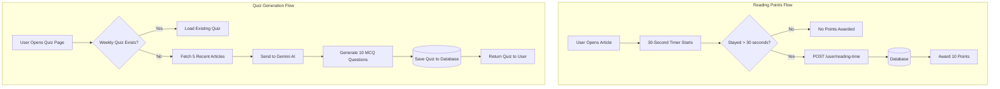

# 📊 System Architecture Diagrams

This document visually explains the architecture, data flow, and core workflows of the **AI News Ecosystem** project.

---

## 1. High-Level Architecture

This diagram outlines how the Frontend (Next.js), Backend (FastAPI), Database (SQLite), AI Services (Gemini), and Event Queue (Kafka) communicate with each other.

---

## 2. News Ingestion Pipeline

This diagram explains how raw news articles are sourced, deduplicated, and stored in the database every 6 hours.

---

## 3. AI Summarization Flow (Kid vs. Pro Mode)

This diagram illustrates what happens when a user clicks on an article and requests a summary. It highlights how the backend decides whether to fetch an existing summary from the DB or dynamically generate one using Google Gemini.

---

## 4. Gamification & Quiz Flow

This diagram maps out how points are awarded for reading time and how the weekly quizzes are dynamically generated based on the latest news articles in the database.

